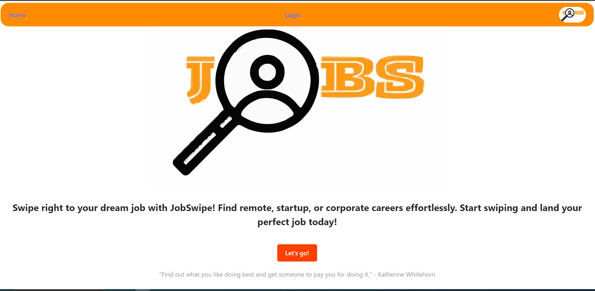
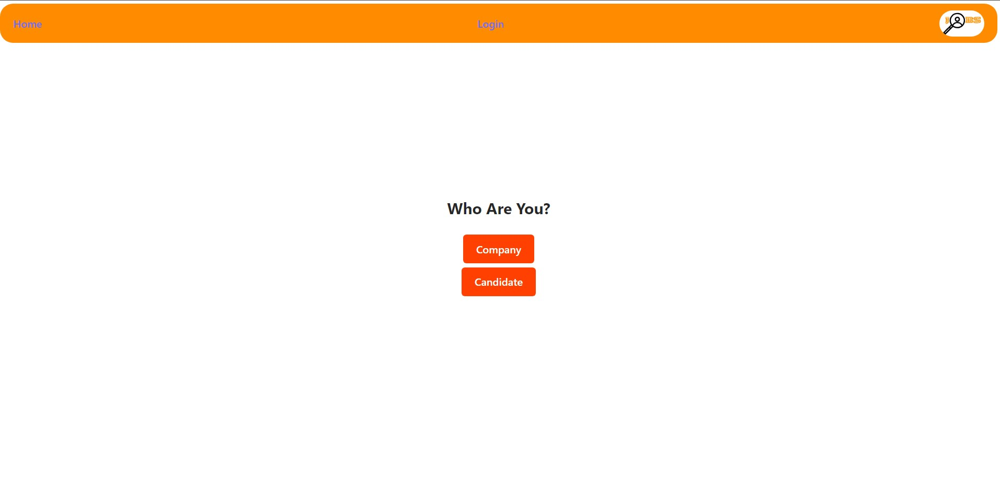
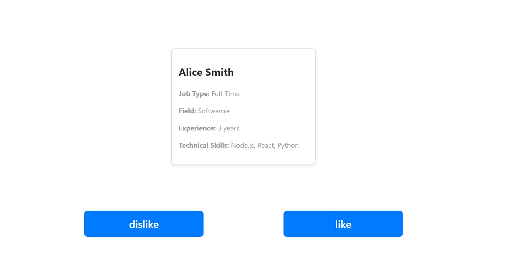
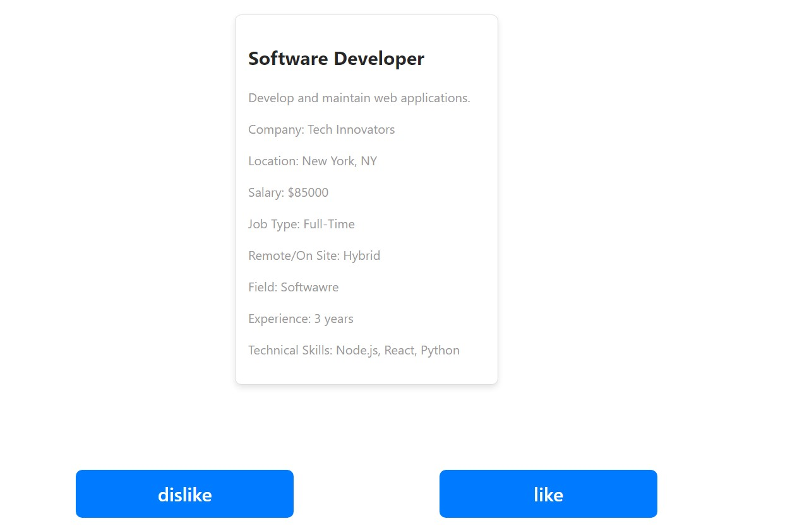
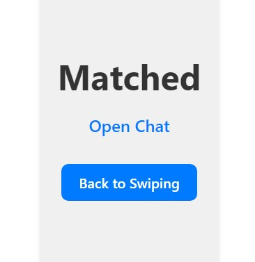

# Job Seeker and Company Matching App

This project is a job matching application built using FastAPI and ReactJS. It includes endpoints for matching jobs to candidates and vice versa, as well as swiping functionality for candidates and jobs.

## Building Instructions

1. Clone the Repository. 
   Choose one of the following, according to you preference:

    HTTPS:
    ```bash
    git clone https://github.com/EASS-HIT-PART-A-2024-CLASS-V/jobmatcher
    
    ```
    SSH:
    ```bash
    git clone git@github.com:EASS-HIT-PART-A-2024-CLASS-V/jobmatcher.git
    
    ```
    GitHub CLI:
    ```bash
    gh repo clone EASS-HIT-PART-A-2024-CLASS-V/jobmatcher
    
    ```

2. Build and Run Via docker-compose

    ```bash
    cd jobmatcher
    docker-compose up
    ```
    
3. Access the Application

    The application should now be available at [http://localhost:5173/](http://localhost:5173/)

## Getting Started

After following the [building instructions](#building-instructions) to run the containers, you can start using the app. You'll be directed to the home page where you can click "Let's Go" or "Login".




Click the Company button to "login" to your profile. For demonstration and simplification, the user details are fixed and hard-coded.



### Company Profile

Click the dropdown arrow and choose the role for which you want to find a matching candidate.


After clicking


Start "swiping" through candidates according to their details by clicking like or dislike. (There are only 10 candidates in this demo.)



Click "Login" and then click the "Candidate" button to "login" as a job seeker. Make sure you click "Like" on the first job!



Great success! You've found a job that likes your profile. You can choose whether to chat or continue looking for the perfect job.



## Entities Description
There are two "match entities", "job" and "candidate" that should have a "match" when one liked the other and vice versa, according to the "likes" list.

## API Endpoints

You can also try "swagger" at [http://localhost:8000/docs](http://localhost:8000/docs) and test manually the following endpoints:

### Home

- **GET /**: Returns a simple home message.

### Job Matching

- **GET /v1/jobs_match/{cand_id}**: Matches jobs for a candidate by their ID.

### Candidate Matching

- **GET /v1/candidates_match/{job_id}**: Matches candidates for a job by its ID.

### Swiping Jobs

- **POST /v1/swiping_jobs/{cand_id}**: A candidate swipes (like/dislike) a job and the Database is updated.
  - **Parameters**:
    - `cand_id` (int): The ID of the candidate.
    - `job_id` (int): The ID of the job.
    - `like` (bool): Whether the candidate likes the job.

### Swiping Candidates

- **POST /v1/swiping_candidates/{job_id}**: A job swipes (like/dislike) a candidate and the Database is updated.
  - **Parameters**:
    - `job_id` (int): The ID of the job.
    - `cand_id` (int): The ID of the candidate.
    - `like` (bool): Whether the job likes the candidate.


### Company Information

- **GET /v1/company/{company_id}**: Retrieves information about a company by its ID.

### Jobs List

- **GET /v1/jobs/**: Retrieves a list of all jobs.

### Field Information

- **GET /v1/field/{field_id}**: Retrieves information about a field by its ID.

### Skills List

- **GET /v1/skills/**: Retrieves a list of all skills.

## Technologies


